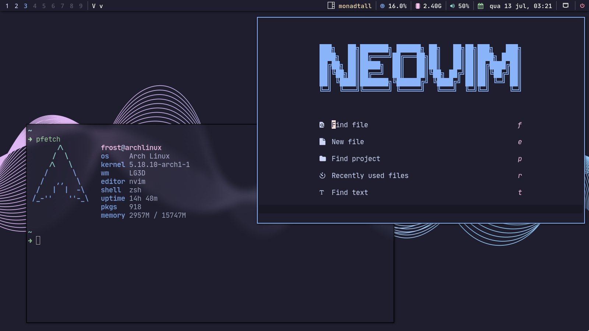

<h1 align="center">Welcome to my dotfiles🐧</h1>

Configuration files for my linux setup.
Currently I use [qtile](https://github.com/qtile) with [Catppuccin](https://github.com/catppuccin).

## About

- Shell: zsh - [Starship](https://github.com/starship/starship)
- Editor: [Neovim (dev release)](https://github.com/neovim/neovim)
- File manager: [Ranger](https://github.com/ranger/ranger), Thunar
- Font: [Iosevka Mayukai](https://github.com/Iosevka-Mayukai/Iosevka-Mayukai)
- Terminal: [Kitty](https://github.com/kovidgoyal/kitty/)
- Notifications: [dunst](https://github.com/dunst-project/dunst)
- Launcher: [rofi](https://github.com/davatorium/rofi)
- GTK theme: [catppuccin](https://github.com/catppuccin/gtk)
- Document Viewer: [zathura](https://git.pwmt.org/pwmt/zathura)
